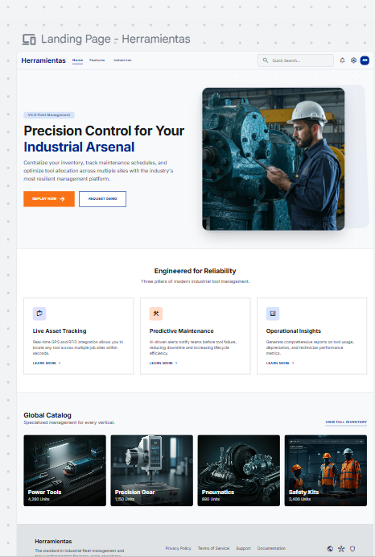
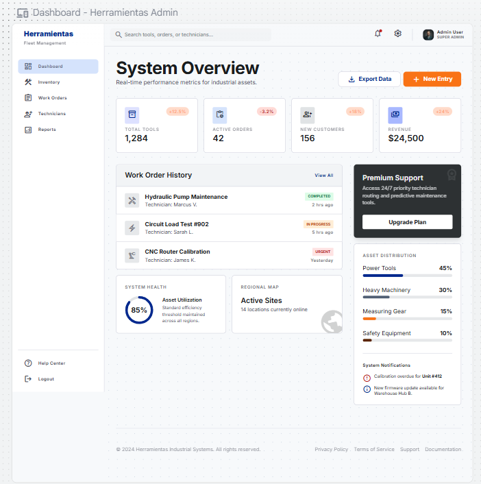
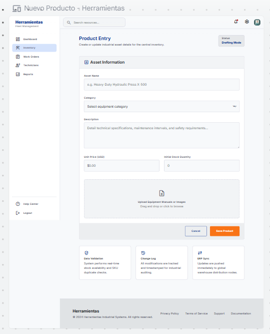
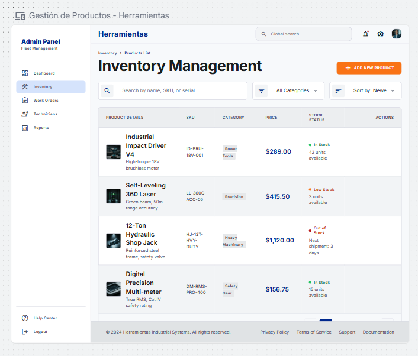
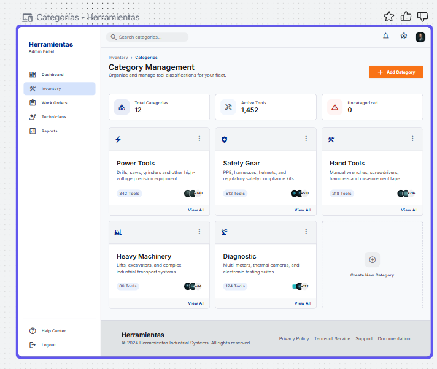
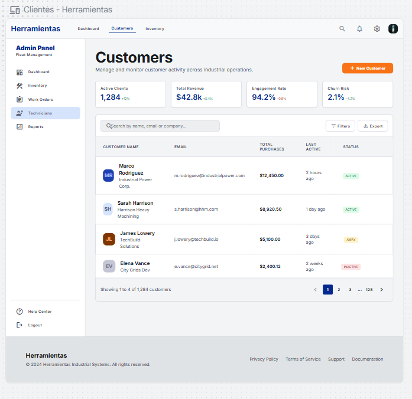
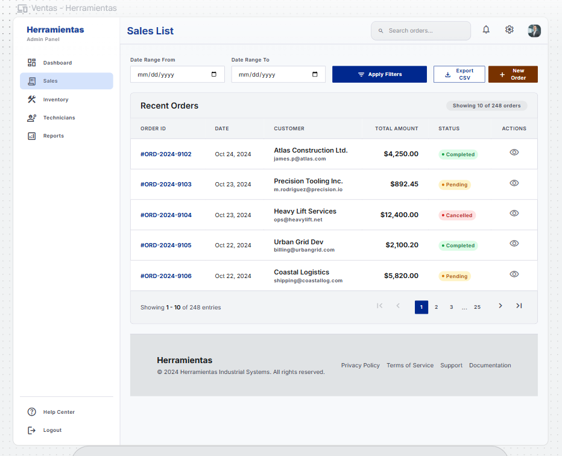

# Práctica: Frontend con Google Stitch + Despliegue con Coolify

**Institución:** Universidad Católica de Cuenca (UCACUE)  
**Estudiante:** Jean Derli  
**Asignatura / Módulo:** Herramientas de Programación  
**Fecha:** 11/06/2026  

---

## 1. Objetivo de la Práctica

Desarrollar e integrar el frontend de una aplicación web para la gestión de herramientas utilizando Google Stitch para el prototipado rápido de UI, React para la lógica de la aplicación y Coolify para el despliegue final usando contenedores.

---

## 2. Paso 1 — Diseño con Google Stitch

En esta fase se utilizó la herramienta Google Stitch para generar las interfaces base de la aplicación. A continuación se detallan los prompts utilizados y las capturas de los resultados.

### 2.1 Landing Page

**Prompt utilizado:**
> "Generar una Landing Page moderna para una plataforma de gestión de herramientas llamada Herramientas. Debe incluir un hero section con el nombre de la app, un eslogan atractivo y un botón CTA. También una sección de características principales, una grilla con categorías de herramientas y un footer."

**Captura:**  


---

### 2.2 Pantallas del Panel de Administración (Admin)

#### Dashboard Principal

**Prompt utilizado:**
> "Crear un dashboard de administración con sidebar lateral de navegación (Dashboard, Productos, Categorías, Clientes, Ventas) y tarjetas de resumen con métricas principales."

**Captura:**  


---

#### Gestión de Productos (Tabla CRUD)

**Prompt utilizado:**
> "Crear una vista con tabla de datos para gestionar productos con columnas de nombre, precio, stock y categoría, incluyendo botones de acción para editar y eliminar, y un botón para agregar nuevo producto."

**Captura:**  


---

#### Formulario Nuevo Producto

**Prompt utilizado:**
> "Diseñar un formulario para crear o editar un producto con campos de nombre, descripción, precio, stock y categoría."

**Captura:**  


---

#### Categorías

**Prompt utilizado:**
> "Diseñar una vista para administración de categorías de herramientas con tabla que muestre ID, nombre y descripción, con botones de editar y eliminar."

**Captura:**  


---

#### Clientes

**Prompt utilizado:**
> "Crear una pantalla de gestión de clientes con tabla que muestre nombre, email, teléfono y dirección, con opciones de búsqueda."

**Captura:**  


---

#### Ventas

**Prompt utilizado:**
> "Generar una interfaz para el historial de ventas con tabla que muestre ID, cliente, fecha y total de cada transacción."

**Captura:**  


---

## 3. Paso 2 — Integración en React (frontend-app/)

El código estático exportado de Google Stitch fue adaptado para estructurar una aplicación dinámica en **React (TypeScript)** utilizando Vite como herramienta de construcción.

### 3.1 Arquitectura y Enrutamiento

Se configuró el enrutamiento mediante `react-router-dom`. La arquitectura define rutas públicas y rutas privadas protegidas con un componente `PrivateRoute`, asegurando que solo usuarios autenticados accedan al panel de administración.

**Rutas implementadas:**

| Ruta | Tipo | Descripción |
|------|------|-------------|
| `/` | Pública | Landing Page |
| `/login` | Pública | Inicio de sesión |
| `/admin` | Privada | Dashboard con métricas |
| `/admin/productos` | Privada | CRUD de productos |
| `/admin/categorias` | Privada | CRUD de categorías |
| `/admin/clientes` | Privada | Listado de clientes |
| `/admin/ventas` | Privada | Historial de ventas |

### 3.2 Cliente HTTP y Autenticación

El consumo de los endpoints de la API se centralizó en `services/api.ts`. Se estableció un `baseURL` relativo (`/api`) para que Nginx enrute las peticiones internamente sin exponer la API directamente.

- **Login:** `POST /api/auth/login` — el token JWT se guarda en `localStorage`
- **Seguridad:** El token se envía automáticamente en el header `Authorization: Bearer <token>` en cada petición
- **Protección de rutas:** Sin token válido, el usuario es redirigido a `/login`

### 3.3 CRUD y Manejo de Estados

Se implementó CRUD completo para **Productos** y **Categorías** (GET, POST, PUT, DELETE), y listados para **Clientes** y **Ventas**.

Cada pantalla maneja estados de:
- **Carga (`cargando`):** Desactiva botones durante operaciones asíncronas
- **Error:** Muestra mensajes cuando falla una petición al backend

---

## 4. Paso 3 — Despliegue con Coolify

### 4.1 Configuración

- Se creó un recurso **Docker Compose** en Coolify apuntando al repositorio de GitHub
- Las variables de entorno `DB_PASSWORD` y `JWT_SECRET` se configuraron directamente en Coolify (no en el código)
- El dominio público se asignó únicamente al servicio frontend (puerto 80)
- La API no está expuesta con dominio propio; las peticiones `/api/*` son enrutadas por Nginx internamente

### 4.2 Verificación del Despliegue

- La landing page carga correctamente en la URL pública
- El endpoint `/login` devuelve token JWT
- El panel admin modifica datos a través de `/api/*`
- La documentación Swagger está disponible en `/docs`

---

## 5. Instrucciones para Ejecución Local

### Requisitos

- Node.js 20+
- npm o bun

### Pasos

```bash
# 1. Clonar el repositorio
git clone https://github.com/Jeanderli/herramientas.git

# 2. Entrar a la carpeta del frontend
cd Herramientas-master/frontend-app

# 3. Instalar dependencias
npm install

# 4. Correr en desarrollo
npm run dev

# 5. Build para producción
npm run build
```

### Variables de entorno

Crear un archivo `.env` en `frontend-app/` con:

```
VITE_API_URL=
```

En producción se deja vacío para que las peticiones usen la ruta relativa `/api`.

---

## 6. Repositorio

**URL del repositorio:** https://github.com/Jeanderli/herramientas
